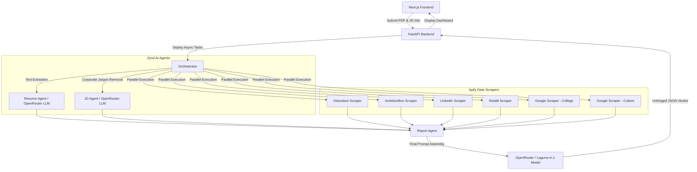

# PlacementIQ

PlacementIQ is a brutally honest, AI-powered career advisory platform designed to help students evaluate job opportunities with complete transparency. By combining resume parsing, job description analysis, and extensive web scraping, PlacementIQ provides an unfiltered reality check on company culture, actual pay fairness versus college medians, and the real day-to-day expectations for a given role.

## Architecture



## Features

- **Resume & JD Parsing:** Extracts relevant skills, experience, and domain knowledge from uploaded PDFs and plain text Job Descriptions.
- **Aggressive Intelligence:** Powered by high-capability LLMs via OpenRouter, acting as an unhinged, heavily sarcastic, but highly protective career advisor.
- **Deep Web Scraping:** Evaluates companies across multiple platforms simultaneously to catch red flags, layoff trends, and real median salaries.
- **Retro-Bold Frontend:** Clean, aggressive Next.js user interface designed for maximum readability and impact.

---

## The Problem

Every year, millions of students step into the job market blinded by false promises. College placement cells inflate statistics, boasting about outlier "highest packages" while hiding abysmal median salaries. Meanwhile, corporate job descriptions are filled with deceptive jargon—rebranding grueling door-to-door sales as "Management Trainee" or masking toxic 70-hour workweeks with terms like "fast-paced collaborative environment." 

Freshers lack the time, industry experience, and tools to look past the marketing fluff. They end up blindly accepting roles that halt their career growth, severely underpay them compared to market standards, or destroy their mental health.

## Why PlacementIQ is Needed

Traditional career advisors and university placement cells have an inherent conflict of interest: they prioritize a "100% placement rate" over the actual quality, compensation, and cultural fit of the jobs they push. 

**PlacementIQ was built to be the anti-placement cell.** 
Students need an unbiased, brutally honest, and purely data-driven entity that holds no punches. By concurrently scraping real-world sentiment (Glassdoor ratings, AmbitionBox salaries, Reddit employee rants, and LinkedIn layoff signals) and feeding it to an unhinged, heavily prompted AI, PlacementIQ cuts through corporate BS. It gives students the unfiltered, aggressive reality check they desperately need *before* they sign a contract that traps them in a nightmare job.

---

## Technology Stack & Core Integrations

This project was built leveraging state-of-the-art developer tools, workflow orchestrators, and scraping technologies.

### 1. GitHub Copilot
**GitHub Copilot** was utilized extensively throughout the development lifecycle to accelerate engineering and ensure high code quality. Its contributions included:
- Rapidly scaffolding the FastAPI backend and strictly typed Next.js React frontend based on design specs.
- Formulating complex async/await concurrency logic in Python for parallel API ingestion.
- Debugging pipeline tracebacks, environment variable configurations, and resolving strict JSON parsing rules for LLM outputs.
- Translating UI mockups and design token references into inline-styled Next.js layouts.

### 2. Apify
**Apify** is the backbone of PlacementIQ's external data gathering. When a user submits a company and college, the backend concurrently dispatches multiple Apify Actors to scrape the web:
- **Glassdoor & AmbitionBox Scrapers:** Used to fetch company ratings, interview experiences, and precise salary data.
- **LinkedIn Profile Scraper:** Used to determine company headcount trends and detect potential layoffs.
- **Reddit Scraper:** Plunges into Reddit threads for unfiltered, anecdotal reports on company toxicity and real work-life balance.
- **Google Search Scrapers:** Captures the true median placement packages for the user's specific college, cutting through inflated university marketing claims.

### 3. Zynd AI
**Zynd AI** is the central nervous system handling our intelligent agent orchestration. Rather than having a monolithic codebase, ZyndAI's Python SDK is used to convert discrete logical functions into maintainable, decentralized micro-agents:
- **`resume-agent`**: Dedicated to interpreting and extracting key entities from the user's uploaded PDF.
- **`jd-agent`**: Specialized in stripping corporate jargon from job descriptions to uncover the *actual* responsibilities.
- **`report-agent`**: The final evaluator that ingests the scraped Apify data and the previous agents' outputs to generate the brutally honest final JSON scorecard.
These agents are deployed on the Zynd AI registry and communicate seamlessly over exposed webhook ports (5001, 5002, 5003).

### 4. OpenRouter
Leveraging **OpenRouter** (specifically the `poolside/laguna-m.1:free` model with internal reasoning capabilities) to power the natural language understanding and generate the final "unhinged" career advice without relying on standard, polite corporate-speak.

---

## Local Setup

### Prerequisites
- Python 3.10+
- Node.js 18+
- API Keys for OpenRouter and Apify

### Backend Installation
```bash
# Clone the repository
cd botathon

# Install Python dependencies
pip install -r requirements.txt

# Start the FastAPI server
uvicorn main:app --port 8011 --reload
```

### Frontend Installation
```bash
# Navigate to the frontend directory
cd frontend

# Install Node modules
npm install

# Start the Next.js development server
npm run dev
```

### Environment Variables
Rename `.env.example` to `.env` and populate your API credentials:
```
OPENROUTER_API_KEY=your_openrouter_key
APIFY_TOKEN=your_apify_token
ZYND_REGISTRY_URL=https://zns01.zynd.ai
```

---

## Usage
1. Open the UI at `http://localhost:3000`.
2. Upload a Resume PDF.
3. Enter the Target Company Name and the Job Description.
4. Input your College Name.
5. Click **Analyze** to dispatch the Apify scrapers and Zynd agents.
6. Read the brutally honest truth.

## Vibelog

Built and deployed PlacementIQ using GitHub Copilot alongside Google Cloud CLI and Apify CLI to accelerate implementation while retaining architectural and technical control. AI assistance was primarily used for scaffolding, boilerplate generation, deployment configuration, and debugging, while all system design, workflow orchestration, and implementation direction were defined by me.

The session included:

* FastAPI backend and Next.js frontend scaffolding
* OpenRouter/OpenAI SDK integration and async scraping pipelines
* Deployment setup for Google Cloud App Engine
* UI refinement and component generation
* Runtime debugging and JSON fallback handling
* Agentic workflow structuring for ZyndAI integration

I also leveraged prior experience with Apify, where I have been an active builder with production actors serving ~100 monthly users.
